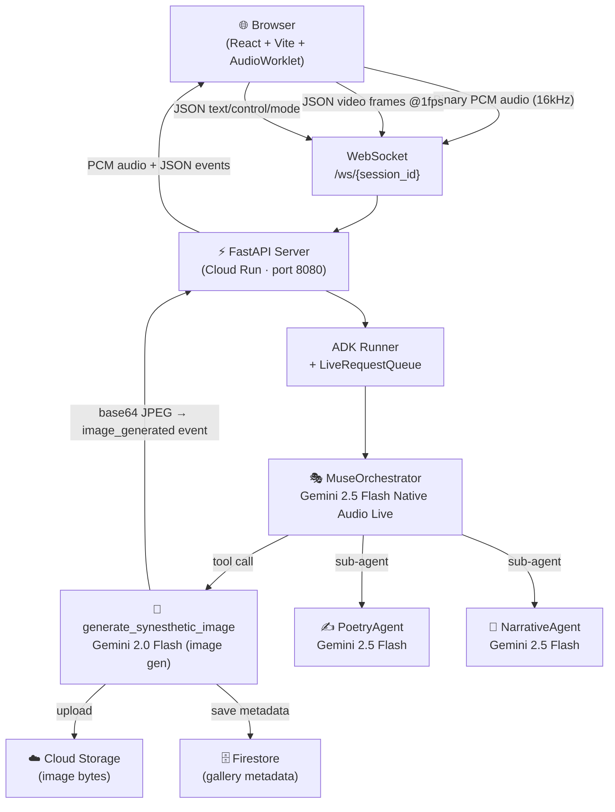

# MUSE — Multimodal Synesthetic Experience Engine

> *What if AI could experience synesthesia?*

Synesthesia is the neurological phenomenon where stimulation of one sense automatically triggers another — a musician who sees colors when they hear notes, a painter who tastes the emotions in her own brushstrokes. MUSE brings that cross-wired perception to artificial intelligence. Powered by the Gemini Live API and Google ADK, MUSE listens to your environment through your microphone, watches the world through your camera, and responds in a continuous real-time stream — speaking what it "hears" in the colors of a painting, generating abstract artwork from the mood of a hummed melody, and weaving an illustrated narrative as you walk through a space. Built for the **Gemini Live Agent Challenge**, MUSE is an experiment in genuine multimodal AI creativity.

---

## Table of Contents

- [Architecture](#architecture)
- [Features](#features)
- [Tech Stack](#tech-stack)
- [Project Structure](#project-structure)
- [Local Development Setup](#local-development-setup)
  - [Prerequisites](#prerequisites)
  - [Backend](#backend)
  - [Frontend](#frontend)
- [Environment Variables](#environment-variables)
- [Running Tests](#running-tests)
  - [Backend Tests (pytest)](#backend-tests-pytest)
  - [Frontend Tests (vitest)](#frontend-tests-vitest)
- [Cloud Deployment](#cloud-deployment)
  - [Automated via Cloud Build](#automated-via-cloud-build)
  - [Manual Docker Deploy](#manual-docker-deploy)
  - [Frontend](#frontend-1)
- [API Reference](#api-reference)
- [Built With](#built-with)

---

## Architecture

```
Browser (React + Vite)
  │
  ├── WebSocket: binary PCM audio (16kHz, 16-bit, mono)
  ├── WebSocket: JSON video frames  { type: "video_frame", data: "<JPEG base64 @1fps>" }
  ├── WebSocket: JSON text/control  { type: "text" | "mode_change" | "end_of_turn" }
  │
  ▼
FastAPI Server (Cloud Run, port 8080)
  │
  └── ADK Runner + LiveRequestQueue
        │
        ▼
      MuseOrchestrator  (gemini-2.5-flash-native-audio-preview-12-2025, Live API)
        │
        ├── [tool] generate_synesthetic_image
        │     └── gemini-2.0-flash-exp-image-generation
        │           Returns base64 JPEG → client event: image_generated
        │
        ├── [tool] save_to_gallery
        │     ├── Cloud Storage  (image bytes)
        │     └── Firestore      (metadata)
        │           Returns entry_id + image_url → client event: gallery_updated
        │
        ├── [tool] get_gallery
        │     └── Firestore query → returns entries list
        │
        ├── [sub-agent] PoetryAgent      (gemini-2.5-flash)
        │     Generates structured poems (haiku / sonnet / free verse)
        │     Output key: generated_poem
        │
        └── [sub-agent] NarrativeAgent   (gemini-2.5-flash)
              Builds ongoing illustrated journey arcs
              Output key: narrative_segment
```

### Architecture Diagram



WebSocket binary frames from the server carry a null-terminated JSON header followed immediately by raw PCM audio bytes:

```
[JSON header]\x00[PCM bytes]
e.g.  {"type":"audio","size":4096}\x00<binary>
```

---

## Features

### Visual Mode
Point your camera at any painting, photograph, or artwork. MUSE analyzes the color palette, texture, and composition in real time and speaks its synesthetic interpretation — describing what sound the brushstrokes would make, what texture the light carries, what emotion the color temperature broadcasts. It then calls `generate_synesthetic_image` to produce a new artwork that translates your original visual into an equivalent experience in a different artistic register.

### Audio Mode
Hum, sing, or play an instrument. MUSE listens through your microphone and builds a visual vocabulary for the melody — describing the color of the intervals, the weight of the rhythm, and the shape of the phrase. It commissions abstract artwork matching the mood and can compose a structured poem via PoetryAgent that reads the music back as text.

### Environment Mode
Walk through a room, a street, or a landscape while narrating or staying silent. MUSE watches the changing scene through the camera and accumulates an ongoing illustrated journey. NarrativeAgent maintains continuity across segments, building a narrative arc. Generated images become illustrated postcards of each chapter of the journey.

### Sketch Mode
Hold a hand-drawn sketch or rough doodle up to the camera. MUSE recognizes your intent, verbally describes what it perceives, and generates a refined illustration that completes and extends your original drawing into a fully realized artwork.

---

## Tech Stack

| Layer | Technology | Version |
|-------|-----------|---------|
| Frontend framework | React | 18.3 |
| Frontend build tool | Vite | 6.x |
| Frontend language | TypeScript | 5.7 |
| Frontend styling | Tailwind CSS | 3.4 |
| Audio processing | AudioWorklet API (PCM capture + playback) | Web standard |
| Backend framework | FastAPI + Uvicorn | 0.115 / 0.32 |
| Backend language | Python | 3.12 |
| Agent framework | Google ADK (multi-agent, Live API streaming) | 1.0+ |
| Orchestrator model | Gemini 2.5 Flash Native Audio Preview | `gemini-2.5-flash-native-audio-preview-12-2025` |
| Image generation model | Gemini 2.0 Flash Experimental | `gemini-2.0-flash-exp-image-generation` |
| Sub-agent model | Gemini 2.5 Flash | `gemini-2.5-flash` |
| Image storage | Google Cloud Storage | 2.19+ |
| Metadata storage | Google Cloud Firestore (native mode) | 2.19+ |
| Backend hosting | Google Cloud Run (gen2) | — |
| Frontend hosting | Firebase Hosting / Cloud Storage | — |
| CI/CD | Google Cloud Build | — |

---

## Project Structure

```
muse/
├── README.md
├── backend/
│   ├── Dockerfile                          # python:3.12-slim, exposes 8080
│   ├── requirements.txt                    # all Python dependencies
│   ├── pytest.ini                          # asyncio_mode = auto
│   └── app/
│       ├── main.py                         # FastAPI app, WebSocket handler, ADK runner
│       ├── config.py                       # dotenv-based configuration
│       ├── agents/
│       │   ├── orchestrator.py             # MuseOrchestrator (LlmAgent, Live API)
│       │   ├── poetry_agent.py             # PoetryAgent (structured poems)
│       │   └── narrative_agent.py          # NarrativeAgent (journey arcs)
│       ├── tools/
│       │   ├── image_generation.py         # generate_synesthetic_image tool
│       │   └── gallery.py                  # save_to_gallery, get_gallery tools
│       ├── services/
│       │   ├── cloud_storage.py            # GCS client + upload helpers
│       │   ├── firestore.py                # Firestore client + CRUD helpers
│       │   └── storage.py                  # shared storage abstractions
│       └── prompts/
│           ├── orchestrator_system.py      # MUSE orchestrator system prompt
│           ├── poetry_system.py            # PoetryAgent system prompt
│           └── narrative_system.py         # NarrativeAgent system prompt
├── frontend/
│   ├── index.html
│   ├── vite.config.ts
│   ├── tailwind.config.js
│   ├── tsconfig.json
│   ├── package.json
│   ├── public/
│   │   ├── pcm-capture-processor.js        # AudioWorklet: mic -> 16kHz PCM
│   │   └── pcm-playback-processor.js       # AudioWorklet: PCM -> speaker
│   └── src/
│       ├── App.tsx                         # Root component, session management
│       ├── main.tsx                        # React entry point
│       ├── index.css                       # Tailwind base styles
│       ├── components/
│       │   ├── CameraPreview.tsx           # Live camera feed display
│       │   ├── ImageGallery.tsx            # Generated image grid
│       │   ├── ModeSelector.tsx            # Visual/Audio/Environment/Sketch switcher
│       │   ├── StatusIndicator.tsx         # WebSocket + ADK connection status
│       │   ├── TranscriptPanel.tsx         # Real-time conversation transcript
│       │   └── WaveformVisualizer.tsx      # Live audio waveform display
│       ├── hooks/
│       │   ├── useAudioCapture.ts          # Mic capture via AudioWorklet
│       │   ├── useAudioPlayback.ts         # PCM playback via AudioWorklet
│       │   ├── useCameraCapture.ts         # Camera frame capture @1fps
│       │   └── useWebSocket.ts             # WebSocket connection management
│       └── types/
│           └── events.ts                   # TypeScript types for all WS events
└── deploy/
    ├── cloudbuild.yaml                     # Automated Cloud Build pipeline
    └── service.yaml                        # Cloud Run service configuration
```

---

## Local Development Setup

### Prerequisites

- **Python 3.12+** — `python3 --version`
- **Node.js 20+** — `node --version`
- **A Google API key** with Gemini API access — [Get one here](https://aistudio.google.com/app/apikey)
- **A GCP project** (for Cloud Storage and Firestore) — optional for basic local use; image generation and gallery persistence require it
- `gcloud` CLI authenticated — `gcloud auth application-default login`

### Backend

```bash
# From the repository root
cd muse/backend

# Create and activate a Python virtual environment
python -m venv .venv
source .venv/bin/activate          # Windows: .venv\Scripts\activate

# Install all dependencies
pip install -r requirements.txt

# Create your local environment file
cp .env.example .env               # or create .env from scratch (see below)
# Edit .env with your keys and project details

# Start the development server with hot-reload
uvicorn app.main:app --reload --port 8081
```

The backend will be available at `http://localhost:8081`. The health endpoint at `http://localhost:8081/health` confirms ADK availability.

> **Note:** The backend defaults to port `8080` via the `PORT` env var. Using `--port 8081` locally avoids clashes with other services. Cloud Run always uses `8080`.

### Frontend

```bash
# From the repository root (in a separate terminal)
cd muse/frontend

# Install dependencies
npm install

# Start the Vite dev server
npm run dev
```

The frontend opens at `http://localhost:5173`. It connects to the backend WebSocket at `ws://localhost:8081/ws/<session-id>` by default. To point it at a different backend, set `VITE_BACKEND_URL` before running:

```bash
VITE_BACKEND_URL=http://localhost:8081 npm run dev
```

---

## Environment Variables

Create `muse/backend/.env` with the following variables. All variables with a default listed are optional — only `GOOGLE_API_KEY` and `GOOGLE_CLOUD_PROJECT` are required for full functionality.

| Variable | Required | Default | Description |
|----------|----------|---------|-------------|
| `GOOGLE_API_KEY` | Yes | — | Gemini API key. Picked up automatically by the `google-genai` SDK. |
| `GOOGLE_CLOUD_PROJECT` | Yes | — | GCP project ID (e.g. `project-b5adb824-a03c-48da-935`). Used for Firestore and Cloud Storage. |
| `GOOGLE_CLOUD_LOCATION` | No | `us-central1` | GCP region for Cloud services. |
| `ORCHESTRATOR_MODEL` | No | `gemini-2.5-flash-native-audio-preview-12-2025` | Live API model used for the MuseOrchestrator root agent. |
| `IMAGE_GEN_MODEL` | No | `gemini-2.0-flash-exp-image-generation` | Model used by the `generate_synesthetic_image` tool. |
| `SUBAGENT_MODEL` | No | `gemini-2.5-flash` | Model used by PoetryAgent and NarrativeAgent. |
| `GCS_BUCKET_NAME` | No | `muse-gallery-images` | Cloud Storage bucket for generated image files. |
| `FIRESTORE_COLLECTION` | No | `muse_gallery` | Firestore collection name for gallery metadata. |
| `HOST` | No | `0.0.0.0` | Bind address for the Uvicorn server. |
| `PORT` | No | `8080` | Port for the Uvicorn server. |
| `CORS_ORIGINS` | No | `http://localhost:5173` | Comma-separated list of allowed CORS origins. |

Example `.env` file:

```dotenv
GOOGLE_API_KEY=AIza...
GOOGLE_CLOUD_PROJECT=project-b5adb824-a03c-48da-935
GOOGLE_CLOUD_LOCATION=us-central1

ORCHESTRATOR_MODEL=gemini-2.5-flash-native-audio-preview-12-2025
IMAGE_GEN_MODEL=gemini-2.0-flash-exp-image-generation
SUBAGENT_MODEL=gemini-2.5-flash

GCS_BUCKET_NAME=muse-gallery-images
FIRESTORE_COLLECTION=muse_gallery

PORT=8081
CORS_ORIGINS=http://localhost:5173
```

---

## Running Tests

### Backend Tests (pytest)

The backend uses `pytest` with `asyncio_mode = auto` (configured in `pytest.ini`). Tests cover agent instantiation, FastAPI endpoints, and tool behavior with mocked Gemini calls.

```bash
cd muse/backend
source .venv/bin/activate

# Run all tests
pytest

# Run with verbose output
pytest -v

# Run a specific test file
pytest tests/test_tools.py -v

# Run a specific test
pytest tests/test_agents.py::test_orchestrator_has_required_tools -v

# Run with coverage report
pip install pytest-cov
pytest --cov=app --cov-report=term-missing
```

Test files:

| File | Coverage |
|------|----------|
| `tests/test_agents.py` | Agent instantiation, tool registration, output keys |
| `tests/test_api.py` | `/health` and `/api/gallery/{session_id}` endpoints |
| `tests/test_tools.py` | `generate_synesthetic_image`, `save_to_gallery`, `get_gallery` with mocks |

### Frontend Tests (vitest)

The frontend uses Vitest with `@testing-library/react` and jsdom.

```bash
cd muse/frontend

# Run all tests once
npm test

# Run in watch mode (re-runs on file changes)
npm run test:watch

# Open the Vitest UI in the browser
npm run test:ui

# Lint the source
npm run lint
```

---

## Cloud Deployment

### Prerequisites

- GCP project with APIs enabled: Cloud Run, Cloud Build, Artifact Registry, Cloud Storage, Firestore, Gemini API
- `gcloud` CLI authenticated with appropriate IAM roles
- A Cloud Storage bucket created and Firestore database initialized in native mode

```bash
export PROJECT_ID=project-b5adb824-a03c-48da-935
gcloud config set project $PROJECT_ID

# Enable required APIs
gcloud services enable \
  run.googleapis.com \
  cloudbuild.googleapis.com \
  artifactregistry.googleapis.com \
  storage.googleapis.com \
  firestore.googleapis.com \
  aiplatform.googleapis.com
```

### Automated via Cloud Build

The `deploy/cloudbuild.yaml` pipeline builds the backend Docker image, pushes it to Artifact Registry, deploys to Cloud Run, and builds the frontend — all in one trigger.

```bash
# Submit a build from the repository root
gcloud builds submit \
  --config muse/deploy/cloudbuild.yaml \
  --substitutions _PROJECT_ID=$PROJECT_ID \
  .
```

Cloud Build configuration highlights:
- Machine type: `E2_HIGHCPU_8`
- Cloud Run: 2 vCPU, 2 GiB RAM, min 1 instance, max 10 instances, 3600s timeout, session affinity enabled
- Logging: `CLOUD_LOGGING_ONLY`

### Manual Docker Deploy

```bash
cd muse/backend

# Build the image
docker build -t gcr.io/$PROJECT_ID/muse-backend:latest .

# Push to Artifact Registry
docker push gcr.io/$PROJECT_ID/muse-backend:latest

# Deploy to Cloud Run
gcloud run deploy muse-backend \
  --image gcr.io/$PROJECT_ID/muse-backend:latest \
  --region us-central1 \
  --platform managed \
  --allow-unauthenticated \
  --timeout 3600 \
  --session-affinity \
  --min-instances 1 \
  --max-instances 10 \
  --memory 2Gi \
  --cpu 2 \
  --set-env-vars "GOOGLE_CLOUD_PROJECT=$PROJECT_ID,GCS_BUCKET_NAME=muse-gallery-images,FIRESTORE_COLLECTION=muse_gallery,CORS_ORIGINS=https://YOUR_FRONTEND_URL"
```

Alternatively, apply `deploy/service.yaml` directly after substituting `PROJECT_ID` and `YOUR_FRONTEND_URL`:

```bash
sed "s/PROJECT_ID/$PROJECT_ID/g; s/YOUR_FRONTEND_URL/your-app.web.app/g" \
  muse/deploy/service.yaml | gcloud run services replace - --region us-central1
```

### Frontend

```bash
cd muse/frontend

# Get the deployed backend URL
BACKEND_URL=$(gcloud run services describe muse-backend \
  --region us-central1 \
  --format 'value(status.url)')

# Build with the production backend URL
VITE_BACKEND_URL=$BACKEND_URL npm run build

# Deploy dist/ to Firebase Hosting
firebase deploy --only hosting

# Or upload to a GCS bucket configured for static hosting
gsutil -m cp -r dist/* gs://your-frontend-bucket/
```

> **Session affinity is required.** Cloud Run must be configured with `--session-affinity` because each WebSocket connection maintains a persistent ADK `LiveRequestQueue`. Without it, HTTP/2 multiplexing can route messages from the same logical session to different backend instances, breaking the live stream.

---

## API Reference

### HTTP Endpoints

| Method | Path | Description |
|--------|------|-------------|
| `GET` | `/health` | Health check. Returns `{"status":"ok","adk_available":true}` |
| `GET` | `/api/gallery/{session_id}` | Fetch gallery entries for a session. Returns `{"entries":[...],"count":N}` |

### WebSocket — `ws://<host>/ws/{session_id}`

#### Client → Server

| Frame type | Format | Description |
|-----------|--------|-------------|
| Binary | Raw PCM bytes | Microphone audio: 16kHz, 16-bit, mono |
| JSON `video_frame` | `{"type":"video_frame","data":"<base64 JPEG>"}` | Camera frame at ~1fps |
| JSON `text` | `{"type":"text","text":"..."}` | Free-form text message |
| JSON `mode_change` | `{"type":"mode_change","mode":"visual\|audio\|environment\|sketch"}` | Switch experience mode |
| JSON `end_of_turn` | `{"type":"end_of_turn"}` | Signal end of user turn |

#### Server → Client

| Event type | Payload | Description |
|-----------|---------|-------------|
| `connected` | `{"session_id":"...","message":"MUSE is ready"}` | Session established |
| Binary | `[JSON header]\x00[PCM bytes]` | Audio response from MUSE (24kHz PCM) |
| `transcript` | `{"text":"...","role":"assistant"}` | Text transcript of MUSE's speech |
| `image_generated` | `{"image_b64":"...","prompt":"...","style":"..."}` | Newly generated synesthetic artwork |
| `gallery_updated` | `{"entry_id":"...","image_url":"..."}` | Image saved to gallery |
| `turn_complete` | `{}` | MUSE has finished its turn |
| `error` | `{"message":"..."}` | Error from ADK or backend |

---

## Built With

- [Google ADK](https://google.github.io/adk-docs/) — Multi-agent orchestration and Live API streaming
- [Gemini Live API](https://ai.google.dev/gemini-api/docs/live) — Real-time bidirectional multimodal conversation
- [Gemini Image Generation](https://ai.google.dev/gemini-api/docs/image-generation) — AI art creation
- [FastAPI](https://fastapi.tiangolo.com/) — High-performance async Python web framework
- [React + Vite](https://vitejs.dev/) — Fast frontend development with HMR
- [AudioWorklet API](https://developer.mozilla.org/en-US/docs/Web/API/AudioWorklet) — Low-latency audio capture and playback
- [Google Cloud Run](https://cloud.google.com/run) — Serverless container hosting with WebSocket support
- [Cloud Storage](https://cloud.google.com/storage) + [Firestore](https://cloud.google.com/firestore) — Gallery persistence

---

*Built for the Gemini Live Agent Challenge 2026*
